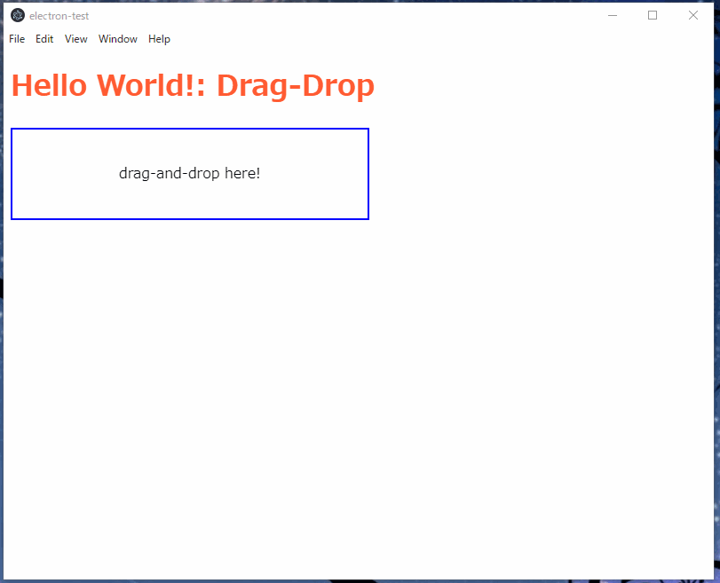

# MWE Electron

- Electronを使ったアプリ開発の例
- 要素
  - fsを利用してドラッグドロップされたファイルがディレクトリか判定する
  - require('fs')の対応が必要　
    - 今回は**nodeIntegration: true**を指定することで対応



## 開発環境

- Windows 10
- Node.js v10.15.3

## 実行

```bash
npm start
```

## 参考

- https://toragramming.toranos.net/programming/electron/electron-env/
- https://teratail.com/questions/172094
